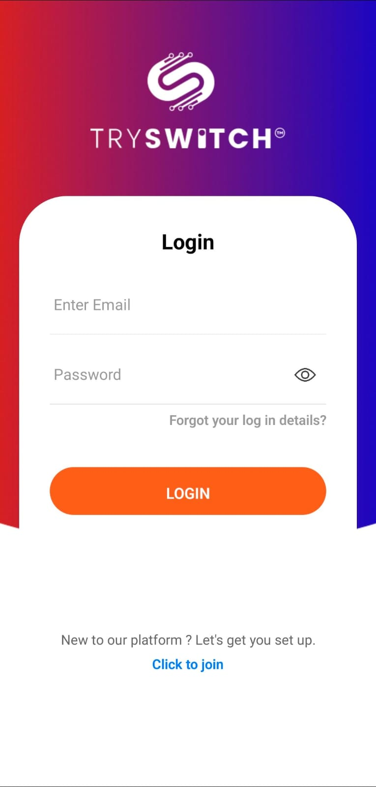
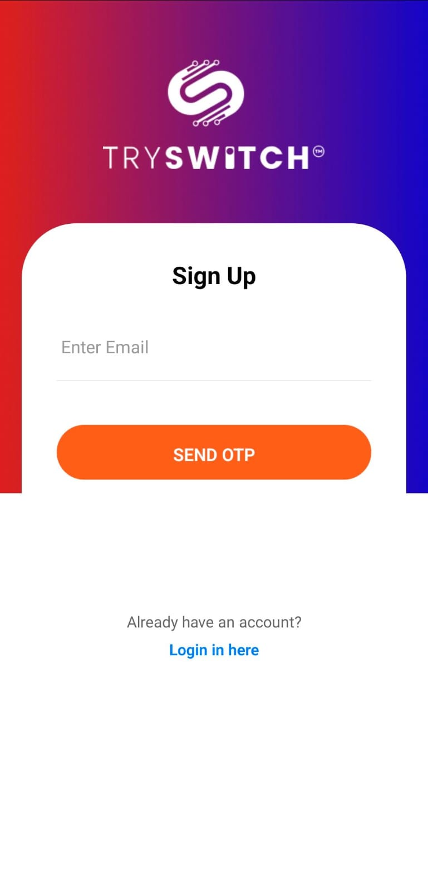
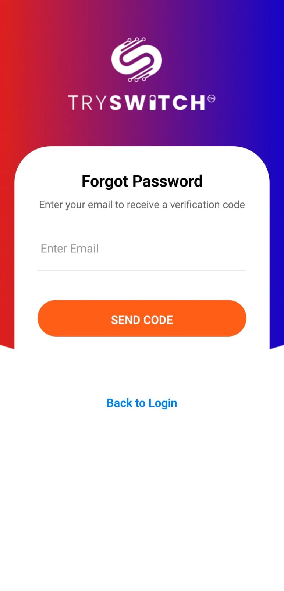
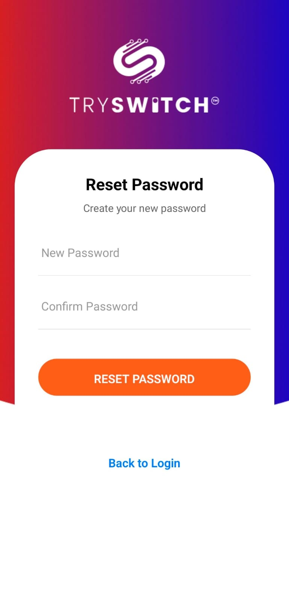
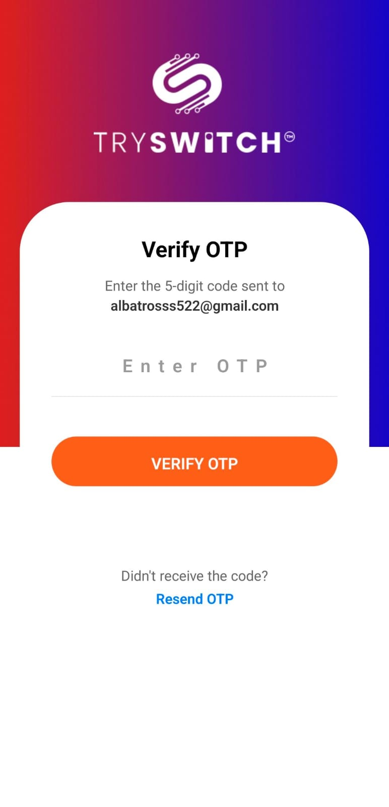
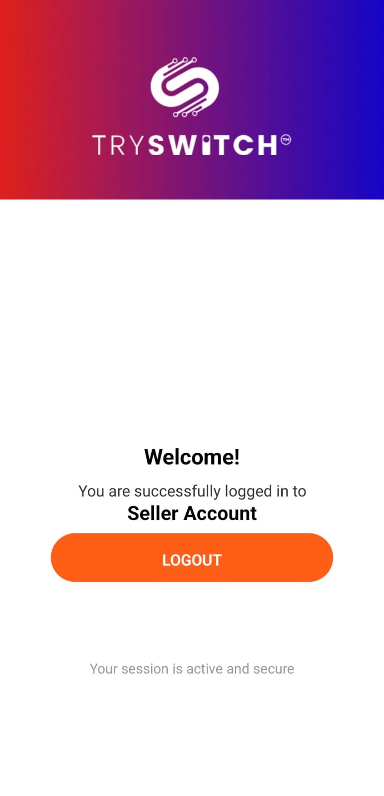

This is a new [**React Native**](https://reactnative.dev) project, bootstrapped using [`@react-native-community/cli`](https://github.com/react-native-community/cli).

---

# 🚀 Getting Started

> **Note:** Make sure you have completed the [React Native - Environment Setup](https://reactnative.dev/docs/environment-setup) instructions till the **"Creating a new application"** step before proceeding.

---
🖼️ App Screenshots

Below are some preview screenshots of the app in action.
Each row contains three images for a clean, professional layout:

<p align="center">    </p> <p align="center">    </p>

📝 Tip: Place your screenshots in a screenshots/ folder at the root of your project.


## 🧩 Step 1: Start the Metro Server

First, you will need to start **Metro**, the JavaScript _bundler_ that ships _with_ React Native.

To start Metro, run the following command from the _root_ of your React Native project:

```bash
# using npm
npm start

# OR using Yarn
yarn start

📱 Step 2: Start your Application

Let Metro Bundler run in its own terminal.
Open a new terminal from the root of your React Native project.
Run the following command to start your Android or iOS app:

For Android
npm run android
# or
yarn android